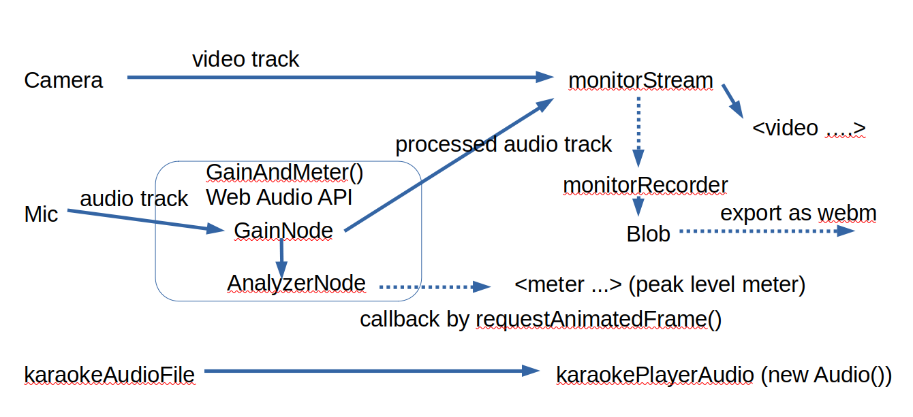

# Overview #

## Input/Output Selection ##
Clicking "Set" button will open the modal window.
Choose one camera input, one audio input, and optionally one karaoke file.

## Signal Path ##

## Sound quality ##

Sound quality is quite good on Linux.

On Windows, turn off mic input boost and additional signal processing.
The feature is for convasational audio but not for vocal or musical
instruments.

On macOS (testing)

### Set audio input gain in the system setting properly ###

Set the gain slider in this App 0dB (default).
Look at the peak meter of this App. 

Adjust the gain in the system sound setting.
The target peak level is -12 to -6dB. 
Reset Peak ocationally.

The gain slider is used for micro adjustment.

